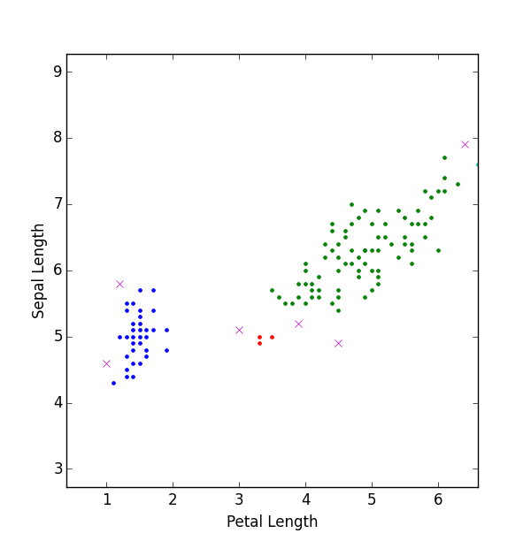

## Introduction

**DBSCAN: Density-Based Spatial Clustering of Applications with Noise**

Author: James Pan <jamesjpan@outlook.com>

**Reference:**

Ester, M., H. P. Kriegel, J. Sander, and X. Xu, "A
Density-Based Algorithm for Discovering Clusters
in Large Spatial Databases with Noise". Proceedings
of the 2nd International Conference on Knowledge
Discovery and Data Mining, Portland, OR, AAAI
Press, pp. 226 - 231. 1996

## Code Example

```python
import dbscan
dbs = DBSCAN(myData, eps, minPts)
results = dbs.run()

To run the included example:
>> import dbscan
>> dbscan.test("iris.data")
```

## Motivation

DBSCAN is a popular clustering algorithm. There is already a very
good implementation of this algorithm in scikit-learn which is much
faster than this one. But maybe this simple implementation can be
useful for some folks studying the algorithm.

## Usage

### Parameters

**D: list of tuples**
stores points as a list of tuples
of the form `(<string id>, <float x>, <float y>)`

    E.g. D = [('001', 0.5, 2.1), ('002', 1.0, 2.4)]

Point ids don't have to be unique.

**eps: float**
maximum distance for two points to be
considered the same neighborhood

    E.g. 0.001

**minPts: int**
Minimum number of points in a neighborhood for
a point to be considered a core point. This
includes the point itself.

    E.g. 4


### Returns

A tuple of a list of Cluster objects and a list of
noise, e.i. `([<list clusters>, <list noise pts>])`


### Methods

`printClusters()` - handy method for printing results
`run()` - run DBSCAN

### Examples

```python
import dbscan

dbs = DBSCAN(D, 0.001, 4)
results = dbs.scan()

# Print with printClusters
dbs.printClusters()

# Print with iteration
for cluster in results[0]:
    print(cluster.cid, cluster.pts)
```

## Test

Try running DBSCAN on the included `iris.data` file
which comes from the popular [Iris Flower dataset](https://en.wikipedia.org/wiki/Iris_flower_dataset).

You should get something that looks like this:


